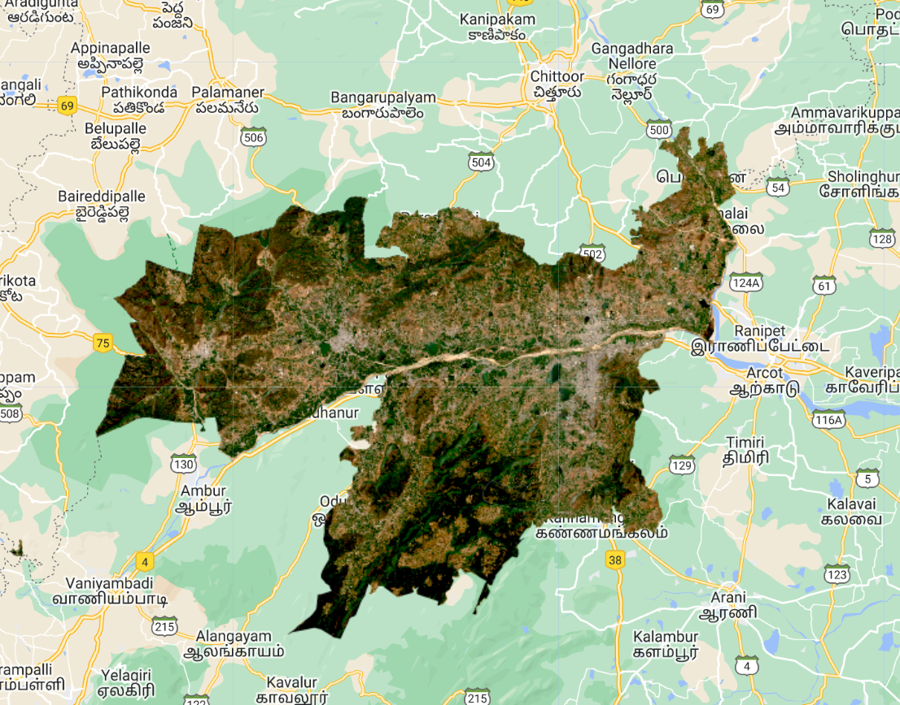
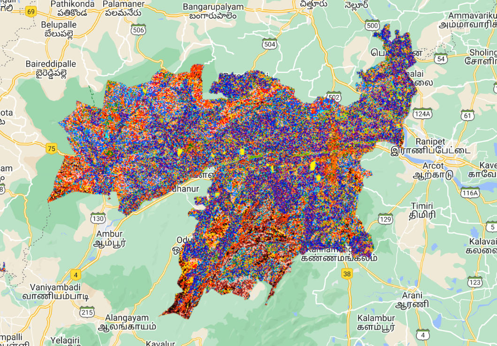
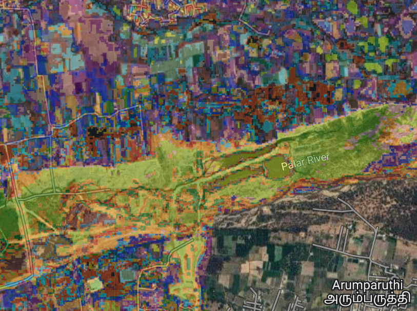
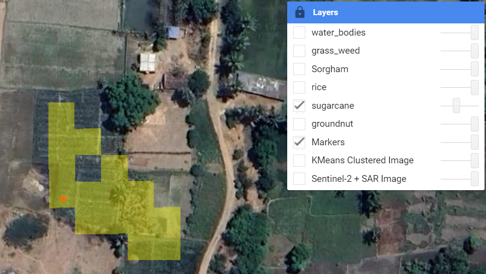

---

# Satellite-Based Crop Classification in Vellore District using Remote Sensing and Google Earth Engine


This project utilizes remote sensing data from Sentinel-1 and Sentinel-2 satellites to classify crop types in Vellore District, Tamil Nadu. By calculating various vegetation indices and using machine learning clustering (K-Means), the project provides insights into crop health, water stress, and land cover classification. This system, implemented using Google Earth Engine, supports precision agriculture practices, contributing to sustainable agricultural management.

## Table of Contents
- [Introduction](#introduction)
- [Data Acquisition and Preprocessing](#data-acquisition-and-preprocessing)
- [Analysis and Clustering](#analysis-and-clustering)
- [Results](#results)
- [Installation and Usage](#installation-and-usage)
- [Contributors](#contributors)

## Introduction

---

Agricultural monitoring using satellite data enables a scalable, real-time approach to assessing crop health, which is essential for supporting sustainable farming and food security. This project leverages satellite data from Sentinel-1 and Sentinel-2, combined with machine learning, to monitor crop types and their health over extensive regions.

### Remote Sensing Data and Index Calculations

1. **Sentinel-2 Multispectral Data**: Sentinel-2 provides high-resolution multispectral imagery that captures a wide range of wavelengths. By calculating vegetation indices, we obtain valuable insights into crop health:
   - **NDVI (Normalized Difference Vegetation Index)**: This index measures vegetation health based on reflectance in the near-infrared and red bands. Healthy crops show high NDVI values, allowing us to monitor growth and detect stress.
   - **NDWI (Normalized Difference Water Index)**: NDWI helps determine the water content of crops by using green and near-infrared bands. It's especially useful for identifying drought stress and optimizing irrigation.
   - **EVI (Enhanced Vegetation Index)**: This index is particularly sensitive to regions with dense vegetation, providing improved accuracy over NDVI in areas with high canopy cover.

2. **Sentinel-1 SAR (Synthetic Aperture Radar) Data**: Unlike optical data, SAR data can penetrate cloud cover, making it reliable even in cloudy conditions. Sentinel-1’s dual polarization (VV and VH bands) captures information on crop structure, density, and moisture:
   - **VV (Vertical-Vertical) and VH (Vertical-Horizontal) Polarizations**: These bands help differentiate crops based on their density and structure, offering additional insights that complement the spectral data from Sentinel-2.

### Machine Learning with K-Means Clustering

The processed data is analyzed using **K-Means clustering**, an unsupervised machine learning algorithm that categorizes different crop types based on unique combinations of spectral indices and SAR features. Key steps in the clustering process include:
- **Feature Extraction and Combination**: The indices (NDVI, NDWI, and EVI) are combined with SAR backscatter data (VV and VH) to form a comprehensive dataset for clustering. Each pixel's spectral and radar characteristics act as distinctive features for classification.
- **Clustering and Classification**: With 50 clusters as the initial setting, K-Means assigns each pixel to a cluster, creating groups that represent various crop types and land cover classes.
- **Variance Analysis for Accuracy Assessment**: The model calculates intra-cluster variance to assess clustering quality. Low variance within clusters indicates consistent classification, helping to ensure accuracy in distinguishing crop types.

### Benefits and Applications
By combining the capabilities of multispectral and SAR data, this system enables:
- **Real-Time Monitoring**: Continuous data acquisition and analysis facilitate near-real-time crop monitoring, crucial for addressing issues like drought or pest infestations.
- **Scalability**: This approach can be applied across large agricultural landscapes, making it suitable for both small-scale farms and extensive agricultural regions.
- **Data-Driven Insights**: Visual outputs, like clustered crop maps, support informed decision-making in agricultural management. Insights into crop health trends and water stress inform better irrigation practices and targeted interventions, ultimately contributing to sustainable agriculture.

---


## Data Acquisition and Preprocessing
### Data Sources
- **Sentinel-2** multispectral images: Filtered for <1% cloud coverage and clipped to Vellore district for 2023.
- **Sentinel-1** SAR images: Filtered to VV and VH polarization bands for analysis of crop structure.

### Preprocessing Steps
1. **Cloud Masking**: Ensures clear, high-quality images.
2. **Spectral Index Calculation**:
   - **NDVI**: Assesses vegetation health by comparing near-infrared and red bands.
   - **NDWI**: Calculates water content by analyzing the green and near-infrared bands.
   - **EVI**: Enhances canopy and vegetation density assessment.
3. **SAR Data Processing**: VV and VH backscatter values are extracted for insights on crop density.


## Analysis and Clustering
The project employs **K-Means clustering** with 50 clusters to differentiate crop types based on spectral signatures and SAR features. To enhance clustering accuracy:
- **Variance Analysis**: Calculated for each cluster using NDVI, NDWI, and EVI to measure clustering quality.
- **Intra-Cluster Variance**: Used as a proxy for model accuracy, with lower variance indicating more consistent clustering.


### Key Calculations
- **NDVI** = (NIR - RED) / (NIR + RED)
- **NDWI** = (GREEN - NIR) / (GREEN + NIR)
- **EVI** = 2.5 * ((NIR - RED) / (NIR + 6 * RED - 7.5 * BLUE + 1))

### Visualizations
Clusters are color-coded to represent distinct crop types, aiding in identifying areas needing intervention. Crops like rice, sorghum, sugarcane, and groundnut are visually differentiated for better analysis.



## Results
The model accurately classifies and monitors crops, validated by ground truth data. The results show:
- **Efficient Crop Differentiation**: Clusters correlate well with field survey data.
- **Low Variance**: Intra-cluster variance of NDVI and NDWI suggests high classification accuracy.
- **Scalability**: The approach is suitable for large-scale monitoring, supporting precision agriculture efforts.



## Installation and Usage
1. **Google Earth Engine**: Ensure access to Google Earth Engine to run the provided script.
2. **Set up the Area of Interest**: Define the region as Vellore district for spatial boundary filtering.
3. **Run the Script**: Calculate indices, perform clustering, and display the layers.

### Code Sample
```javascript
// Define Vellore District Boundary
var table = ee.FeatureCollection("projects/repository_name/assets/TAMILNADU_SUBDISTRICT_BDY");
var vellore = table.filter(ee.Filter.eq('District', 'VELLORE'));

// Load and Filter Sentinel-2 Data
var image = ee.ImageCollection("COPERNICUS/S2_SR_HARMONIZED")
  .filterBounds(vellore)
  .filterDate("2023-01-01", "2023-12-30")
  .filterMetadata('CLOUDY_PIXEL_PERCENTAGE', 'less_than', 1)
  .median()
  .clip(vellore);

// Calculate Indices
var ndvi = image.normalizedDifference(['B8', 'B4']).rename('NDVI');
var ndwi = image.normalizedDifference(['B3', 'B8']).rename('NDWI');
```

## Contributors
This project is a collaborative effort by:
- [Utkarsh Kumar Rajput](https://github.com/utkarshkr13)
- [Sparsh Kumar](https://github.com/Sp2k04)
- [Saurav Kumar](https://github.com/SauravKumar710)


---

### License
MIT License. See `LICENSE` for details.

